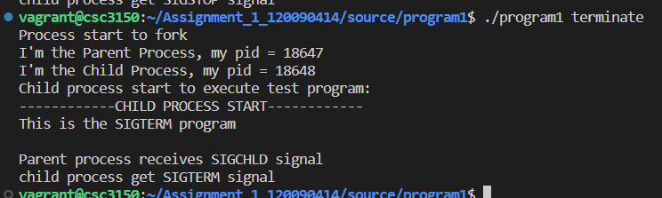

# CSC3150 Assignment1 Report
#### Name: Xiang Fei    
#### Student ID: 120090414

## 1. Design
### 1a. Overview
Assignment 1 asks us to do some programming exercise about process in user mode and kernel mode. In this assignment, we need to learn how to install the virtual machine and deploy the kernel environment. Besides, we are required to understand the working logic of process and kernel. And for bonus question, we need to learn the proc filesystem, how to get the pid, ppid, and other information of a process.

### 1b. Task 1
Task 1 is quite simple, since it is based on user mode. In this task, we need to fork a child process, and then, execute the test program and get the status signal information from child process. Finally, we are required to print out this information in parent process. The pivotal API that I used in this task is **fork()**, **execve()**, **waitpid()**, etc. First, I use **fork()** to generate a child process. Then, **execve()** is used in child process to execute the test program. During the execution, **waitpid()** is used in parent process to wait for child process terminates and get the returned signal information. Finally, in parent process, I use **WIFEXITED()**, **WEXITSTATUS()** and **WIFSTOPPED()** to check the received signal and print out the information.


### 1c. Task 2
Task 2 is more difficult than task 1, since it is based on kernel mode, which means that we need to deploy the correct kernel environment and implement the same function in a more underlying way. The detailed of deploying the environment will be discussed in later. Here, I just focus on the functions we need to implement in task 2. First, I write **myfork()** function to create a kernel thread. In fact, this function is based on two functions **my_exec()** and **my_wait()**, which are also written by myself. **my_exec()** function is used for child process to executing the test program, which is based on **do_execve()** and **getname_kernel** (get the filename of the test program). For the parent process, it will wait until the child process terminates using **my_wait()** function, which is based on **do_wait()** and combine the construction of the wait_opts structure (since it is not included in the head file, we need to write this structure by ourselves), and then print the signal information to kernel log. Similar to task 1, I classify the signal according to its value, here is the member variable wo_stat of wait_opts structure and we need to use (& 0x7f) since the value we get from wo_stat is the true signal shifted for some signals. Finally, exit the module. Since we need to use the functions in kernel source code, we are required to export the symbol in kernel source code and extern them in our script, including **kernel_clone**, **do_execve**, **getname_kernel** and **do_wait**. After the modification, recompilation of the kernel is needed. The updated modules need to be installed.


### 1d. Bonus Task
In this task, we need to write a code to implement the **pstree** function in linux commend and the options of this function. I will introduce my implementation in detail. First, I construct a structure call **TNode** to store the information of each process and thread, including PID, PPID, TGID, process name, the child process pointer, the peer process pointer, the boolean type variables checkFirstChild (whether it is the first child in the next generation, which influences the print logic), InThreadGroup (whether it is in thread group, which also influences the print logic, whether we need to use {} when print out the process name), HasBeenConsidered (it is used when building the node, if it has bee considered, then we don't need to consider it again). Here, the boolean type is defined by myself. Then, I get the process information in /proc directory, here I enter the number directory and read the /status file to get the detail information, such as pid, ppid, tgid, process name. And for thread, I get their information through /task, and tgid is their parent's pid. These information are first stored in arrays. And then, I build the tree by recursively invoke **buildNode** function. After I build the tree, I recursively invoke **PrintNode** function to print this tree like **pstree** commend. In fact, since the time is really limited and I want to learn this knowledge, so my implementation method is based on a github repository. But I still do some personal work to modify that code, for example, the coding logic, the printing format of the tree, and the options of this commend. I just want to show the elegant implementation and my understanding of this task, which is based on recursion method. TAs are not necessarily give me the full grade of bonus task since it is not totally my work. I implement the options -p and -V.

### 1e. Some details
1. The initialization of wait_opts object is like the following.

```c
struct wait_opts wo;
  struct pid *wo_pid = NULL;
  enum pid_type type;
  type = PIDTYPE_PID;
  wo_pid = find_get_pid(pid);

  wo.wo_type = type;
  wo.wo_pid = wo_pid;
  wo.wo_flags = WEXITED | WSTOPPED; // it is used to deal with the stop signal
  wo.wo_info = NULL;
  wo.wo_rusage = NULL;
```

2. The initialization of kernel_clone_args object is like the following.

```c
struct kernel_clone_args kargs = {
    .flags = ((SIGCHLD | CLONE_VM | CLONE_UNTRACED) & ~CSIGNAL),
    .pidfd = NULL,
    .child_tid = NULL,
    .parent_tid = NULL,
    .exit_signal = SIGCHLD & CSIGNAL,
    .stack = (unsigned long)&my_exec,
    .stack_size = 0,
    .tls = 0};
```

I know the values of the member variables by seeing the source code.

### 1f. Setting clang-format

The clang-format I used is the same as the kernel source code.

First, I copy the ".clang-format" file from the linux-kernel to my assignment directory. 


And I install the clang-format-8 (the version is larger than or equal to 4, otherwise, there is some problem). Then, I use the commend like the following to change my code format to be the same as the kernel source code format.


## 2. Set up the environment
### 2a. Environment

OS version: Ubuntu 16.04.7 LTS

Kernel version: 5.10.27

gcc version: 5.4.0 (above 4.9, satisfy the requirement)


### 2b. Details of setting up the environment

The installation of virtual machine and the settings of vagrant, the compilation process is introduced very meticulously in tutorial, so I think I don't need to repeat the procedure here. The most important thing is my modification in kernel source code.

I need to export symbols of four functions "kernel_clone"(/kernel/fork.c), "do_execve" (/fs/exec.c), "getname_kernel" (/fs/namei.c) and "do_wait"(/kernel/exit.c). I use "sudo su" to get the permission to modify kernel code and use vim to modify it. The code is just like:

```c
EXPORT_SYMBOL(do_execve);
```

We should pay attention that the code should added after the inclusion of head files. And for static function, we need to delete the "static" keyword.

In our c program, we need to extern these functions, like the following:


After modifying the kernel source code, we can compile the code. The procedure in tutorial is very detailed, like the following:


## 3. Execution
### 3a. Task 1
1. Cd to the directory of program 1 (containing all the source codes and makefile)
2. Type "make"
3. Type "./program1 testfile". testfile is the file to be executed in child process. For example, "./program1 alarm"

### 3b. Task 2
1. Update the kernel source code (add EXPORT_SYMBOL() for 4 functions invoked)
2. Compile the kernel: sudo su; cd to kernel file; make mrproper; make clean; make menuconfig (need to install a tool here); (Recompile start from here) make bzImage; make modules; make modules_install; make install;
3. reboot
4. Cd to the directory of program 2 (containing all the source codes and makefile).
5. Compile the test program: gcc –o test test.c
6. Type "sudo make"
7. Type "sudo insmod program2.ko" to install the module.
8. Type "sudo rmmod program2" to remove the module.
9. Type "dmesg" to get the kernel log.

### 3c. Task 3
1. Cd to the directory of bonus (containing all the source codes and makefile)
2. Type "make"
3. Type "./pstree" to see the normal print result. Type "./pstree -V", "./pstree -p" to see the print result under options.

## 4. Output
### 4a. Task 1
1. Abort signal


2. Alarm signal


3. Bus signal


4. Floating signal


5. Hangup signal


6. Illegal_instr signal


7. Interrupt signal


8. Kill signal


9.  Normal signal


10. Pipe signal


11. Quit signal


12. Segment_fault signal


13. Stop signal


14. Terminate signal



15. trap signal


### 4b. Task 2
1. Abort signal


2. Alarm signal


3. Bus signal


4. Floating signal


5. Hangup signal


6. Illegal_instr signal


7. Interrupt signal


8. Kill signal


9.  Normal signal


10. Pipe signal


11. Quit signal


12. Segment_fault signal


13. Stop signal


14. Terminate signal


15. trap signal


### 4c. Bonus Task

1. ./pstree


2. ./pstree -V


3. ./pstree -p


## 5. My feeling
I have gained a lot from this assignment. The process of completing this assignment was not smooth sailing, and many difficulties were encountered during the process. For example, the virtual machine and physical machine do not have enough memory at the beginning, which leads to problems with kernel compilation; the kernel version used in the demonstration in the tutorial is different from the version we need to use, and there is nothing about the usage of those interfaces on the Internet. Detailed introduction, which led me to read the source code myself to learn how to use those interfaces and the logic in them, which is quite difficult.


In this assignment, I learned how to install the virtual machine and deploy the kernel environment. Besides, I also understand the working logic of process and kernel. And for bonus question, I learned the proc filesystem, how to get the pid, ppid, and other information of a process. For me, since I have an internship about backend-development, I'm familiar with linux commend, but this is the first time for me to implement a linux commend by myself using c language. And before, I have never learned the knowledge about kernel. I find that I already touch some more basic knowledge about computer and programming. It helps me a lot.


Last but not least, I can feel that TAs are hard-working and laborious for this course. They have large workloads and will be disturbed by mountains of questions raised by students. Good luck to you!
