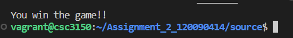

# CSC3150 Assignment2 Report
#### Name: Xiang Fei    
#### Student ID: 120090414

## 1. Design
### 1a. Frogger Game
Assignment 2 requires us to write frogger game using multithread programming. In this game, the user needs to control the frog by keyboard to cross a river by jumping to some floating logs. These logs will move from left to right or right to left staggerly. The user will win if the frog jumps to the other bank of river successfully; will lose  if the frog lands in the river, or the log reaches the left/right side of the river but the frog still on it. 

For the program design, I will explain it in terms of shared variables, functions, threads design, program flow and mutex lock usage.

* **Shared Variables**:

To implement the multithread program, we need to set some global variable, which is shared within the whole program. "mutex" is the mutex lock to be used. "flag" is a integer signal to represent the game states, in which 0 means normal, 1 means win, -1 means lose, 2 means quit. "usleep_time" is the time for the screen to update, which can be used to control the logs' moving speed. "frog" is a instance of a defined structure Node, which records the position of the frog. "map" stores the information of the graph to be printed.

* **Functions**

"kbhit" Determine a keyboard is hit or not. If yes, return 1. If not, return 0. It plays a vital role in controlling the frog. 

"logs_move" is used to move the logs. In this function, I first initialize the positions of the logs. I use a array to record the position of the start point (left end) for each log, the index represents the x coordinate information, and the value represents the y coordinate information. The initial value is generated using rand() function, and the range is from 0 to COLUMN-1. Then, I implement the movement of logs within a while loop (condition is normal state). In each time interval, the logs move 1 character long way. For odd rows, they move left; for even rows, they move right. And in fact, in this function, I also implement the movement of the frog with the logs when it stays on these logs, and also the logic to examine whether the fog is falling into the river or touch the boundaries, if yes, clear the screen and print out the lose information. For every normal while loop, we will clear the original screen and print out the new one.

"frog_move" is used to implement the movement of the frog according to the hit keyboard. In fact, movement is just to change the coordinates, and in the next update, the frog's position will change, which means move. When hit 'w' or 'W', the frog move forward, and when the x coordinate is 0 (reach the other side of the river), then change flag to 1 and print out the win information. When hit 'a' or 'A', the frog move left, and if touch the left boundary, change flag to -1 and print out the lose information. When hit 'd' or 'D', the frog move right, and if touch the right boundary, change flag to -1 and print out the lose information. When hit 's' or 'S', the frog move backward. When hit 'q' or 'Q', change the flag to 2 and quit the game, print out the quit information.

"main" function implement the main process. First initialize the river map and frog's starting position, print out the original map. and create pthreads for logs move and frog control. Then use pthread_join to wait the process of these pthreads. In the end, destroy the mutex lock and quit the program.

* **Threads Design**

I have created 2 threads in this program. One is for the movement of logs, it can also update the screen at the end, print out the current map and use "usleep" to control the updating frequency in a while loop. One is for the movement of frog, and it will receive the keyboard input to decide how the frog will move in the next step.

* **Program Flow**

At first, the map will be initialized, and the frog will stand at the middle of the bottom side of the river. Then, initialize the mutex lock, and create the 2 threads (log, frog). The threads will run iteratively until the frog reaches the other side of the river or die in the process (go back at the origin, hit the boundaries, drown into river). Then the threads are joined, and the threads exit one by one. The message for game status will be printed out. And the mutex will be destroyed in the end.


* **Mutex Lock Usage**

Mutex lock is the primary mean to implement thread synchronization and protect shared date. When a piece of the code is locked, the threads cannot perform the operations simultaneously. Multiple writes and multiple reads are not allowed. The lock provides the protection of accessing the shared data resource. As a result, it should be added to the processes which deal with the shared data (global variables). In this program, I add one mutex lock, which is in the threads for moving the logs, and it is used to prevent multiple writing to the map and ensure safety (during the process the information of the frog in the map is also changed), and then, print out the updated map. It can also help to protect the map from changing when showing the map to the screen. Pay attention that the mutex lock should be unlocked before the usleep() or the threads cannot run normally since the time interval of one lock is too large.

### 1b. Bonus (Thread Pool)
In the bonus task, we are required to implement a simple thread pool.

Thread pool technology refers to the ability to ensure that any thread created is in a busy state, without the need to frequently create and destroy threads for a certain task, because the system consumes cpu resources when creating and destroying threads. very large. If there are many tasks, the frequency is very high, and threads are started and then eliminated for a single task, then this situation is quite inefficient. The thread pool technology came into being to solve such an application scenario.

At the beginning, a certain number of threads are created in the form of queues, and a work queue is allocated to them. When the work queue is empty, it means that there are no tasks. At this time, all threads hang up waiting for new work to arrive. When a new job arrives, the head of the thread queue starts to execute the task, and then the second and third threads execute the newly arrived task in turn. When one of the threads finishes processing the task, the thread immediately begins to accept the task assignment. So that all threads are in a busy state and improve the efficiency of parallel processing.

When no jobs are coming, our threads created in async_init have to go to sleep and is not allowed to do busy waiting like while(1){sleep(any);}, and when jobs are coming a sleeping thread in our thread pool must wake up immediately (that is, no sleep() call is allowed). What's more, async_run should be asynchronous without further call to pthread_create, that is it should return immediately before the job is handled (in the code TAs give us, async_run runs synchronously, so we need to rewrite the function).

* **Structure Design**

```c
typedef struct my_item {
  void (*work_item_hanlder)(int);
  int args;
  struct my_item *next;
  struct my_item *prev;
} my_item_t;

typedef struct my_queue {
  int size;
  my_item_t *head;
  pthread_t *thread_id;
  pthread_cond_t my_queue_ready;
  pthread_mutex_t my_queue_lock;
} my_queue_t;
```

"my_item" is the task structure, the 'work_item_hanlder' member variable is the task function handler. 'args' is the argument of the task function. 'next' is a pointer which points to the next task in the bidirectional task linked list. 'prev' is a pointer which points to the previous task in the bidirectional task linked list. 

"my_queue" is the thread pool structure. 'size' represents the size of the thread pool (the number of threads in this pool). 'head' is the head task in the bidirectional task linked list. 'thread_id' is the array of the threads in this pool. 'my_queue_ready' is the conditional variable. 'my_queue_lock' is the mutex variable.


* **Function Design**

**thread_function**:

```c
static void *thread_function(void *args){
    my_queue_t *p = (my_queue_t*)args;
    my_item_t *work_item;
    while(1){
        pthread_mutex_lock(&(p->my_queue_lock));
        while(!p->head){
            pthread_cond_wait(&(p->my_queue_ready),&(p->my_queue_lock));
        }
        work_item = p->head;
        DL_DELETE(p->head,p->head);
        pthread_mutex_unlock(&(p->my_queue_lock));
        work_item->work_item_hanlder(work_item->args);
        free(work_item);
    }
    return NULL;
}
```

This function is used to implement the wait and asynchronous running logic. When we create the pthread, we use this function. Then, in each thread, the function will be executed. In this function, we use a while loop to implement the reuse of the thread. When there is no task to be executed, we use pthread_cond_wait to let the thread sleep. If task coming, then one thread will wake up by receiving a signal, delete the head task and execute it. After that, it will continue to sleep if no more tasks are coming.

**async_init**:

```c
void async_init(int num_threads) {
    thread_pool = (my_queue_t*)malloc(sizeof(my_queue_t));
    pthread_mutex_init(&(thread_pool->my_queue_lock),NULL);
    pthread_cond_init(&(thread_pool->my_queue_ready),NULL);
    thread_pool->size = num_threads;
    thread_pool->thread_id = (pthread_t*)malloc(sizeof(pthread_t)*num_threads);
    thread_pool->head = NULL;
    for(int i=0;i<num_threads;i++){
        pthread_create(&(thread_pool->thread_id[i]),NULL,thread_function,thread_pool);
    }
    return;
}
```

This function is used to initialized the thread pool and create the pthreads. 'thread_pool' here is a global variable which is defined outside the function. And when use "pthread_create", the execute function in each thread is the above function "thread_function", and its argument is just the thread pool pointer. Please pay attention to allocate memory space for thread pool and the thread array, otherwise, segment fault may happen.

**async_run**:

```c
void async_run(void (*hanlder)(int), int args) {
    my_item_t *work_item;
    work_item = (my_item_t*)malloc(sizeof(my_item_t));
    work_item->work_item_hanlder = hanlder;
    work_item->args = args;
    work_item->next = NULL;
    work_item->prev = NULL;

    pthread_mutex_lock(&(thread_pool->my_queue_lock));
    
    DL_APPEND(thread_pool->head,work_item);
    
    pthread_cond_signal(&(thread_pool->my_queue_ready));
    pthread_mutex_unlock(&(thread_pool->my_queue_lock));
}
```

In this function, the work item is created according to the input function handler and arguments of the input function. Then, the task is added to the end of the task queue. After that, a condition signal will send to a thread to wake up that thread, in order to execute the task. Please don't forget to allocate memory for work item, otherwise, segment fault may happen.

## 2. Environment

* Linux version


* Linux Kernel Version


* GCC Version


## 3. Execute Steps
### 3.1 Frogger Game

First, go the the source directory: **cd ./source/**

Then, compile the cpp file using: **g++ hw2.cpp -lpthread**

last, type **./a.out** to execute the program. The procedure is like the following graph:


### 3.2 Bonus Task

First, go to the thread_poll directory: **cd ./3150-p2-bonus-main/thread_poll/**

Then, type **make** to compile the files.

Last, type: ./httpserver --proxy inst.eecs.berkeley.edu:80 --port 8000 --num-threads 5

When you run the test, you can access 127.0.0.1:8000 at your browser even before modifying the code, but it cannot serve the request concurrently (multiple requests at the same time) and always serve with the same thread id. After implementing the thread pool you should support concurrent access.


* For the test case in piazza:

keep your server spinning with ./httpserver --files files/ --port 8000 --num-threads T (please replace T with a thread number, say 10). Then in another terminal you can use ab -n X -c T http://localhost:8000/ (please replace X with the total request number, say 5000, and T with the thread number, say 10) to benchmark your thread pool implementations. The following is a example commend.


## 4. Output
### 4.1 Frogger Game

* starting case:


* In the middle case:


* win case



* lose case


* quit case


### 4.2 Bonus Task
* The case provided in readme file:


And the webpage:


click lectures:


* The case provided in piazza:


## 5. My feeling
This assignment took me a lot less time than the first assignment, and it was not as difficult as I imagined. The amount of code is not large, and the logic is not complicated. To do this job well, the most important thing is to understand multi-threaded programming and those APIs. The following is what I learned in this assignment:

1. Multi-thread programming: Through lecture, I learned the basic knowledge of multi-threading, and then through the tutorial and the exercise of this homework, I have a better understanding of its specific use and common APIs, and the creation, termination, joining, and signal conditions of threads. and mutexes are more familiar. This project made me more interested in multithreaded programming.
2. Improve my c++ programming ability: Through this assignment, I have a deeper understanding of C language strings and pointers, dynamic memory allocation in bonuses, and structures, and I am more familiar with this language. I think this can help me a lot.

That's all of this report.