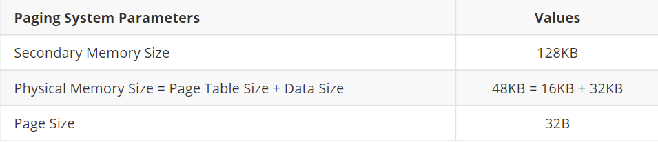
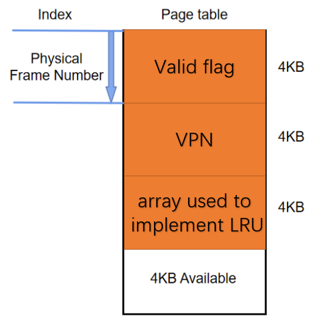
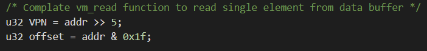
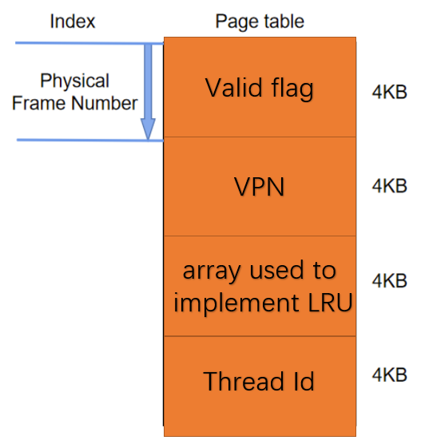
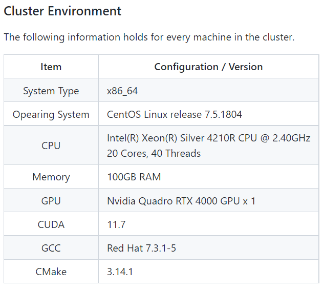
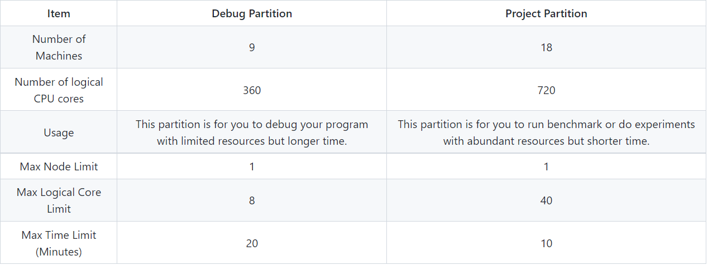
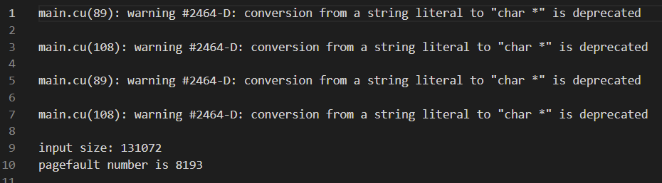
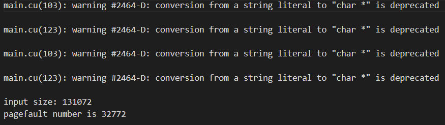

# CSC3150 Assignment3 Report
#### Name: Xiang Fei    
#### Student ID: 120090414

## 1. Design
### 1a. Basic Task

* Task Description
  
In this task, we will use the CUDA (Compute Unified Device Architecture) in the GPU to implement the paging system because of its small size and low access latency. The following are the implementation requirements.



In addition, when there are no entries for reading and writing in the page table, we need to use the LRU algorithm to exchange.

* Memory Allocation Design

First, we have a total of 4 data sets:
1. Input Buffer (Virtual Memory)
2. Share Memory (Physical Memory)
3. Disk Storage (Secondary Memory)
4. Result Buffer which contains all the data read from the physical memory

Physical memory is divided into 2 parts: page table(16KB) and data access(32KB)

The most important part in the paging system is the design of the page table

In my implementation, page table contains:
1. A valid flag for each page number
2. Physical frame number or virtual page number (inverted page table)

The page size is set to be 32B, there are totally 32KB / 32B = 1024 entries in the data access part of the physical memory. However, the size of the virtual memory can be much larger than 32KB because the input size is determined by the user. So it may be impossible to insert all the virtual page number into the page table. As a result, I choose to use the inverted page table. The following graph shows the inverted page table I used. (In fact, waste many space, just a simple implementation, since this homework's requirements is not so strict)



For each physical frame number, we will have assign 1 mapped virtual page number, 1 valid flag, and 1 LRU-related number. In this way, we have not used all the memory space in the given page table. In total 1024 physical frame entries will lead to 1024 * 3 * 4 = 12KB memory, which is less than 16KB.

* Logic for vm_read and vm_read

The main arguments for the function vm_read() and vm_write() is a virtual memory address, so we first need to convert the virtual memory address to the corresponding virtual page number.



Then we will do operations based on this VPN.

1. Search for virtual page number in the page table

First traverse the "Virtual Page Number" part (the first 1024 entries) of the page table, if we can find the same VPN, the index of this non-empty entry will be the corresponding physical frame number.

So we just use this physical frame number together with the offset which we have obtained earlier to conduct reading or writing from the physical memory.

2. Add VPN into the page table

Suppose we fail to find exactly the same virtual_page_number in the page table, we may need to write this VPN into the page table. We first find an empty entry in the page table with its index as physical frame number. Then, I change the valid flag of this physical frame to "valid". Last, I change the mapped virtual page number to the value of VPN

3. The LRU implementation

If the page table is already full and there is no empty entry for us to write in virtual page number, we may need to pick a victim entry and put all its corresponding data into the secondary storage to give us an empty entry. The mechanism of the LRU-related array is: Whenever we conduct vm_read() or vm_write() at a certain physical frame number, we will reset its LRU-related value to 0, and increase the LRU-related values at all the other non-empty frame numbers by 1. And when we initialize the memory, all of the LRU-related values are set to be 0.

```c++
for(int i=0;i<vm->PAGE_ENTRIES;i++){
    if(vm->invert_page_table[i]==0x00000000){
      if(i==LR_entry){
        vm->invert_page_table[i+2*(vm->PAGE_ENTRIES)] = 0;
      }
      else{
        vm->invert_page_table[i+2*(vm->PAGE_ENTRIES)] += 1;
      }
    }
  }
```

In this way, the most recent frame that we use will have the maximum LRU-related value, which is 0. The least recent frame that we use, on the other hand, will have the minimum LRU-related value. Thus we can just traverse the LRU-related value of each physical frame and find frame number with the smallest LRU-related value. This frame will be the victim.

The "swapping" operations are different for vm_read and vm_write.

For vm_write, we only need to put the victim into the disk. Use the frame number of the victim to locate the starting address of the its physical memory. And then, move 1 page of data after the starting address from the physical memory to the secondary memory, the starting address in the secondary memory will be determined by the mapped virtual page number of the frame number.

```cpp
for(int i=0;i<vm->PAGESIZE;i++){
    vm->storage[vm->invert_page_table[LR_entry+vm->PAGE_ENTRIES]*\
    (vm->PAGESIZE)+i] = vm->buffer[LR_entry*(vm->PAGESIZE)+i];
  }
```

* vm_snapshot
In this part there is no complicated logic. The program just invokes vm_read() to read all data in the physical memory and the secondary memory in the virtual memory sequence.

### 1b. Bonus Task

* Task Description
  
To start multiple threads (4 threads) and each thread uses the paging mechanism, we should design a new page table to manage multiple threads.

* Launching Multiple Threads

We have defined the page table, the page fault number, the physical memory, and the secondary memory as macro variables. which means that all the 4 threads will share the same memory as well as the page fault number.

Shared memory will be fine, however the share upon page fault number may possibly result in wrong output when multiple threads are accessing the same variable.

Thus we need to particularly keep different threads independent from each other in this program. We can distinguish different threads by its thread id and let only one thread run each time.

```cpp
if(tid==0){
    user_program(&vm, input, results, input_size);
  }
  __syncthreads();
  if(tid==1){
    user_program(&vm, input, results, input_size);
  }
  __syncthreads();
  if(tid==2){
    user_program(&vm, input, results, input_size);
  }
  __syncthreads();
  if(tid==3){
    user_program(&vm, input, results, input_size);
  }
```

```cpp
dim3 block(4,1);
mykernel<<<1, block, INVERT_PAGE_TABLE_SIZE>>>(input_size);
```

* New Page table

In order to let the page table differentiate virtual page numbers of different threads, we need to add a "tid" attribute to each frame. Therefore, the page table is like the follows.



So when we conduct vm_read and vm_write, we need to encapsulate the tid corresponding to this frame into the page table. Also, we need to compare both the VPN and the tid when we traverse the page table.

```cpp
vm->invert_page_table[i+3*(vm->PAGE_ENTRIES)] = threadIdx.x;
```

```cpp
if(vm->invert_page_table[i+vm->PAGE_ENTRIES]==VPN && \
vm->invert_page_table[i+3*(vm->PAGE_ENTRIES)]==threadIdx.x) \
//page can be found in the page table
```

## 2. Running Environment

* Cluster Environment



* Slurm Partition and Job

Partitions group nodes into logical sets, and jobs are allocations of resources assigned to a user for a specified amount of time. Partitions can be considered as job queues, each of which has an assortment of constraints such as job size limit, job time limit, users permitted to use it, etc. Priority-ordered jobs are allocated nodes within a partition until the resources (nodes, processors, memory, etc.) within that partition are exhausted. Once a job is assigned a set of nodes, the user is able to initiate parallel work within the allocation. There are two partitions in our cluster: Debug and Project.



## 3. Execution Steps

In the source or bonus directory, use "sbatch ./slurm.sh", then the program runs and you just need to wait for the results.

for source task, the slurm.sh is like:

```sh
#!/bin/bash

##Resource Request

#SBATCH --job-name CSC3150_Assignment3
#SBATCH --gres=gpu:1
#SBATCH --output result.out   ## filename of the output; the %j is equivalent to jobID; default is slurm-[jobID].out
#SBATCH --partition=Debug     	## the partitions to run in (comma seperated)
#SBATCH --ntasks=1  ## number of tasks (analyses) to run
#SBATCH --gpus-per-task=1 # number of gpus per task
#SBATCH --mem-per-gpu=100M # Memory allocated for the job
#SBATCH --time=0-00:02:00  ## time for analysis (day-hour:min:sec)

##Compile the cuda script using the nvcc compiler
nvcc --relocatable-device-code=true main.cu user_program.cu virtual_memory.cu -o test

## Run the executable file
srun ./test
```

And for the bonus task, the running time should increase, otherwise, you may can't finish the running. The slurm.sh is like:

```sh
#!/bin/bash

##Resource Request

#SBATCH --job-name CSC3150_Assignment3
#SBATCH --gres=gpu:1
#SBATCH --output result.out   ## filename of the output; the %j is equivalent to jobID; default is slurm-[jobID].out
#SBATCH --partition=Debug     	## the partitions to run in (comma seperated)
#SBATCH --ntasks=1  ## number of tasks (analyses) to run
#SBATCH --gpus-per-task=1 # number of gpus per task
#SBATCH --mem-per-gpu=100M # Memory allocated for the job
#SBATCH --time=0-00:08:00  ## time for analysis (day-hour:min:sec)

##Compile the cuda script using the nvcc compiler
nvcc --relocatable-device-code=true main.cu user_program.cu virtual_memory.cu -o test

## Run the executable file
srun ./test
```

## 4. Results and analysis
1. Results

* Sample output for the basic task: (The warning is not a big deal)



And we can compare the generated snapshot.bin and the data.bin, they are the same:


* Sample output for the bonus task:



And we can compare the generated snapshot.bin and the data.bin, they are the same:


2. Analysis

In the input file data.bin, there are totally 128KB (131072KB) data, which is 131072KB / 32B = 4096 pages.

* vm_write

In the sample user program, 4096 pages of data are written into the physical memory together. However, the page table can only hold 1024 pages. So for the first 1024 pages, the page table is completely empty and every page's first data that is written into the memory will cause a page fault. Thus 1024 page faults are raised. For the remaining 3072 pages, there is no space in the page table so the paging system will carry out LRU algorithm. Frames are swapped out from 0 index to 1023 index for 3 cycles, where page fault number will increase to 4096. The current pages left in the page table will be the last 1024 pages in the virtual memory. As a result, the total page fault number for vm_write is 4096.

* vm_read

In the sample user program, the last 32800B data, which is 1025 pages, are read from the physical memory. However, the page table only contains the last 1024 pages of data. So at the last page that the user intends to read will cause a page fault. The page fault is 1.

* vm_snapshot

The snapshot function will read data in a sequence from virtual memory address 0 to the end. However, the current page table only contains 1024 pages in the last 1025 pages. So every page that is read will cause a page fault, which is 4096.

Therefore, the total page fault number is: 4096 + 1 + 4096 = 8193

For the bonus part, essentially the program just run the user program for 4 times, so the output page fault number also times 4, which is: 8193 * 4 = 32772


## 5. My feeling

* Understand the Paging Mechanism

This assignment greatly enhanced my understanding of the computer paging system. We should not only make memory allocation possible, but also pay attention to the efficiency, memory usage and multithreading management of the paging system. In order to use less memory, we realize that it is unnecessary to enter all virtual page numbers into the page table. The advantages of inverted page table are really reflected in this assignment. However, if we try to save memory, the increase in time complexity is inevitable. In this program, I only use an array to implement LRU, but it is time-consuming to traverse 1024 integers in the page table to find the minimum LRU related value. It may be better to use double linked list and hash technique to implement LRU. I also better understand that computer memory is multi-layered. Main memory (or physical memory in this allocation) is the fastest but the smallest. Along with the auxiliary memory (disk), the computer can process large amounts of data.

* Basic knowledge about computer resources and CUDA programming

In this assignment, we also need to learn the basic knowledge about computer resources and CUDA programming, which I have never exposed to before. Although I am still not familiar with these fields, at least this assignment gave me a chance to learn more about it later when I need it.

That's all of this report.