# CSC3150 Assignment4 Report
#### Name: Xiang Fei    
#### Student ID: 120090414

## 1. Design
### 1a. Basic Task

* **Task Description**
  
In this task, we need to implement a mechanism to manage the file system through GPU memory. File systems provide efficient and convenient access to disks by allowing data to be easily stored, located, and retrieved. File systems present two distinct design problems. The first problem is to define how the file system should be presented to the user. This task involves defining the files and their attributes, the operations allowed on the files, and the directory structure used to organize the files. The second problem is creating algorithms and data structures to map the logical file system to physical secondary storage devices. The file organization module knows about files and their logical and physical blocks. By knowing the type of file allocation used and the file location, the file organization module can translate logical block addresses into physical block addresses for basic file system transfers. The logical blocks of each file are numbered from 0 (or 1) to N. Since the physical blocks containing the data often do not match the logical numbers, translation is required to locate each block. The logical file system manages metadata information. Metadata includes all file system structures other than actual data (or file content). The file organization module also includes a free space manager that keeps track of unallocated blocks and provides these blocks to the file organization module when requested. The logical file system manages the directory structure, providing the file organization module with the information required by the latter, given a symbolic filename. It maintains the file structure through file control blocks. A file control block (FCB), an inode in a UNIX file system, contains information about a file. Since there is no OS in the GPU to maintain a logical file system mechanism, we can try to implement a simple file system with a single thread in the CUDA GPU and limit the size of the global memory.


* **The GPU File System we need to design:**

We take the global memory as a volume (logical drive) from a hard disk. There is no directory structure stored in the volume, only a root directory, and no subdirectories in this file system. In this project, we use only one of GPU memory, the global memory as a volume. We don’t create the shared memory as physical memory for any data structures stored in, like system-wide open file table in memory. In this simple filesystem, we just fetch information directly from the volume (in global memory) via a single thread. The structure is showed in the following:

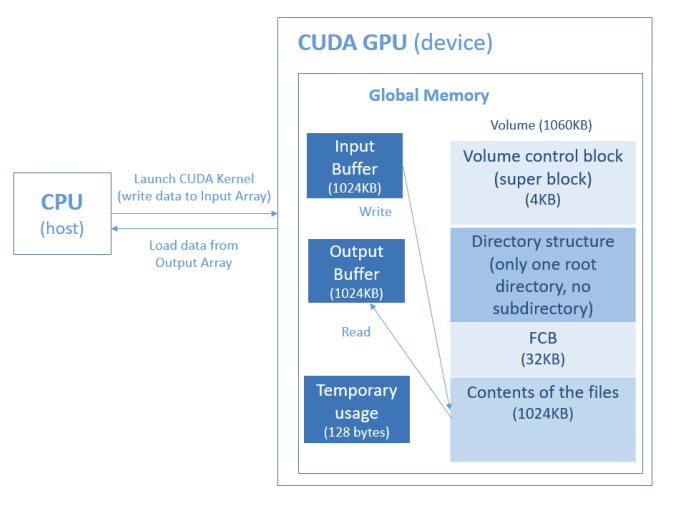

* **FCB design**
My FCB design is 32 bytes per FCB. And there are five kinds of information to store: 20 bytes file name, 4 bytes file size, 2 bytes modified time, 2 bytes create time, 4 bytes file address(also the begin block). It is showed in the following graph.

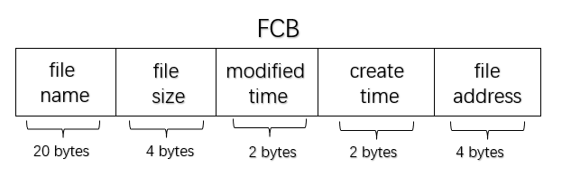

* **initialize the file system**

The file system is like the following:

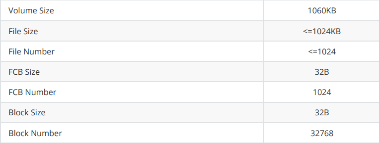 

Therefore, we initialize the file system in the following way:

```cpp
// init variables
  fs->volume = volume;

  // init constants
  // VCB size: 4096 byte = 4KB
  fs->SUPERBLOCK_SIZE = SUPERBLOCK_SIZE;
  // 32 bytes per FCB (20 bytes name, 4 bytes size, 
  //2 bytes modified time, 2 bytes create time, 4 bytes file address)
  fs->FCB_SIZE = FCB_SIZE;
  // 1024 FCB (also means maxmimum 1024 files)
  fs->FCB_ENTRIES = FCB_ENTRIES;
  // 1085440 byte = 1060 KB
  fs->STORAGE_SIZE = VOLUME_SIZE;
  // 32 bytes
  fs->STORAGE_BLOCK_SIZE = STORAGE_BLOCK_SIZE;
  // 20 bytes
  fs->MAX_FILENAME_SIZE = MAX_FILENAME_SIZE;
  // maximum 1024 files
  fs->MAX_FILE_NUM = MAX_FILE_NUM;
  // maximux 1048576 byte = 1024 KB
  fs->MAX_FILE_SIZE = MAX_FILE_SIZE;
  // the base address to store the content of files: 4096+32768 byte = 36 KB
  fs->FILE_BASE_ADDRESS = FILE_BASE_ADDRESS;
```

* **My function design**

1. **fs_open**
In this function, I first try to find the corresponding file by checking the file name in FCBs. If the file can be found, then for G_READ operation, I directly return the index of the corresponding FCB; for G_WRITE operation, I first invoke fs_gsys(fs,RM,s) to remove the file, and in order to create a same file, I find an empty FCB to add the same file name. If the file can not be found, then for G_WRITE, I find an empty FCB to create a new file, and add the file name and the create time into the FCB, then, return the index of the FCB.

2. **fs_read**
This function is really simple, first, use the FCB to find the file address (begin block), then dump the content of the file into the output buffer.

3. **fs_write**
In this function, I first add the file size and the modified time into the corresponding FCB. Then I need to find an empty block to add the file address and write the content. So I use VCB to implement it.

```cpp
if((fs->volume[i/8]>>(7-i%8)&0x01)==0x00)
```

The above condition is used to check whether an block is empty or not (0 means empty, 1 means not). When I find the empty block, I take it as the file address and add it into the FCB. Then, I dump the content in the input buffer to the content of the file. After that, I change the new used VCB entry to 1 by the following way:

```cpp
u32 bit_num;
if(size%32==0){
  bit_num = size/32;
}
else{
  bit_num = size/32+1;
}
for(int j=i;j<i+bit_num;j++){
  fs->volume[j/8] = fs->volume[j/8]|(0x80>>(j%8));
}
```

4. **fs_gsys(FileSystem \*fs, int op)**
This function implements LS_D and LS_S operations, which means sort by modified time and sort by file size respectively. For sort by size, we also need to print the size, and when the size are the same, then we follow the first create first print principle. At the beginning, I create a temporary array (life is smaller then the program, just for sort), whose length is 1024. Each entry of the array means whether the corresponding index FCB stores a file's information (1 means has, 0 means not). When get the entries, I also get the file num. And then, I write a for loop (file num times), in each for loop, I traverse the 1024 files to find the max target file, and print its name (or name and size), and for LS_S, I also compare the create time to satisfy the first create first print principle. 

5. **fs_gsys(FileSystem \*fs, int op, char \*s)**
In this function, I implement the RM operation, which is used to delete a file. First, I try to find the index of the corresponding file. After I find the target file, I first clear the FCB data. And then, I clear the file content. Besides, I update the VCB of the deleted file to 0 in the following way:

```cpp
int bit_num;
if(size%32==0){
  bit_num = size/32;
}
else{
  bit_num = size/32+1;
}
for(int k=begin_block;k<begin_block+bit_num;k++){
  fs->volume[k/8] = fs->volume[k/8]&(uint8_t)~(0x80>>(k%8));
}
```

In addition, I implement the compaction. I first check whether the FCB of the deleted file is in the middle (otherwise, we don't need compaction). If it is in the middle, I compact the file content and update the VCB of all later blocks (move the file content to the deleted file position, and change the VCB bit to the before block's VCB bit). After that, I update the FCB, first change the file address, and then compact the FCB.


### 1b. Bonus Task

* **Task Description**
  
In basic task, there is only one root directory for the file system. In bonus, we must implement tree-structured directories. A directory (or subdirectory) contains a set of files or subdirectories. A directory is simply another file. There are at most 50 files (include subdirectories) in a directory. The size of a directory is the sum of character bytes of all files name (include subdirectories).

* **The GPU File System we need to design:**

I just slightly change the file system in the basic task, I add 32 bytes in the volume as a virtual root directory, and I also add 2 bytes to record the current directory. (smaller than 128B, satisfy the requirements).

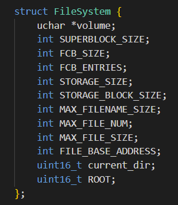


* **FCB design**
My FCB design is 32 bytes per FCB. And there are six kinds of information to store: 20 bytes file name, 2 bytes file size, 2 bytes parents directory FCB index, 2 bytes modified time, 2 bytes create time, 4 bytes file address(also the begin block). It is showed in the following graph.

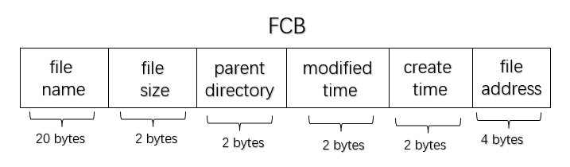

* **initialize the file system**

We initialize the file system in the following way:

```cpp
// init variables
  fs->volume = volume;

  // init constants
  // VCB size: 4096 byte = 4KB
  fs->SUPERBLOCK_SIZE = SUPERBLOCK_SIZE;
  // 32 bytes per FCB (20 bytes name, 2 bytes size, 2 bytes parent directory, 
  //2 bytes modified time, 2 bytes create time, 4 bytes file address)
  fs->FCB_SIZE = FCB_SIZE;
  // 1024 FCB
  fs->FCB_ENTRIES = FCB_ENTRIES;
  // 1085472 byte
  fs->STORAGE_SIZE = VOLUME_SIZE;
  // 32 bytes
  fs->STORAGE_BLOCK_SIZE = STORAGE_BLOCK_SIZE;
  // 20 bytes
  fs->MAX_FILENAME_SIZE = MAX_FILENAME_SIZE;
  // maximum 1024 files
  fs->MAX_FILE_NUM = MAX_FILE_NUM;
  // maximux 1048576 byte = 1024 KB
  fs->MAX_FILE_SIZE = MAX_FILE_SIZE;
  // the base address to store the content of files: 4096+32768+32 bytes
  fs->FILE_BASE_ADDRESS = FILE_BASE_ADDRESS;
  fs->current_dir = ROOT;
  fs->ROOT = ROOT;
```
* **directory determination**
Here, I use a tricky way to check whether a FCB stores the information for file or directory. For directory, since it has no content, so I set it file address as 0x11111111, therefore, when the file address is 0x11111111, it is a directory.


* **My function design**

1. **fs_open**
In this function, I first try to find the corresponding file by checking the file name in FCBs and also the whether it is in the current directory. If the file can be found, then for G_READ operation, I directly return the index of the corresponding FCB; for G_WRITE operation, I first invoke fs_gsys(fs,RM,s) to remove the file, and in order to create a same file and maintain the size of the parent directory (since when RM file, its size decreases), I find an empty FCB to add the same file name and update the parent dir. If the file can not be found, then for G_WRITE, I find an empty FCB to create a new file, and add the file name and the create time into the FCB, also update the size of the parent directory then, return the index of the FCB.

2. **fs_read**
Just the same as the basic task.

3. **fs_write**
In this function, compare to the basic task, I just add the parent directory of the file (since when use RM in open or create a new one, both are needed to add this information), and I update the modified time of the parent directory.

4. **fs_gsys(FileSystem \*fs, int op)**
In this function, for the implementation of LS_D and LS_S, I first add the judgement which means whether the traversed file/directory is under the current directory. And for directory case, I add an affix ' d\0' to the original print information. For CD_P operation, I just change the current directory to its parent directory. For PWD operation, I trace back to the foremost parent directory. I use 2 levels of while loop and an array to record the absolute path: in the inner loop, I will trace back to the foremost parent directory and record its directory name into the array. The foremost parent directory will be replaced by its next level each outer loop.
 
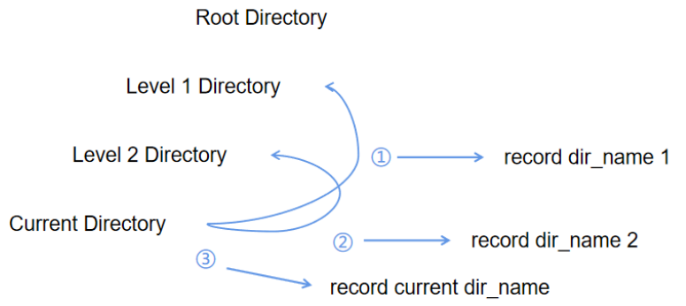

5. **fs_gsys(FileSystem \*fs, int op, char \*s)**
In this function, for RM operation, compare to the basic task, I also need to update the size of the parent directory, and after compaction, I need to decrease the current directory index by 1 if the FCB of the current directory if not the root and its index is larger than the FCB index of the deleted file. For MKDIR operation, I first check whether the directory is already exist. If it is not exist, then I need to create a new directory. I first find an empty FCB, and then, I update the parent directory size, add the create time, add directory address (which is its identifier 0x11111111), add parent directory, add modified time, add directory size (which is 0 now), and also, update the modified time of the parent directory. For CD operation, I just check whether the target directory is in the current directory by traverse the FCBs, and if I find it, I just change the current directory to the target directory. For RM_RF operation, I first find the directory, and then, I update the parent directory size. After that, I clear FCB of the directory and implement compaction as RM. And then, I use recursion to delete the inner files and directories by RM and RM_RF. 

## 2. Running Environment

* Cluster Environment

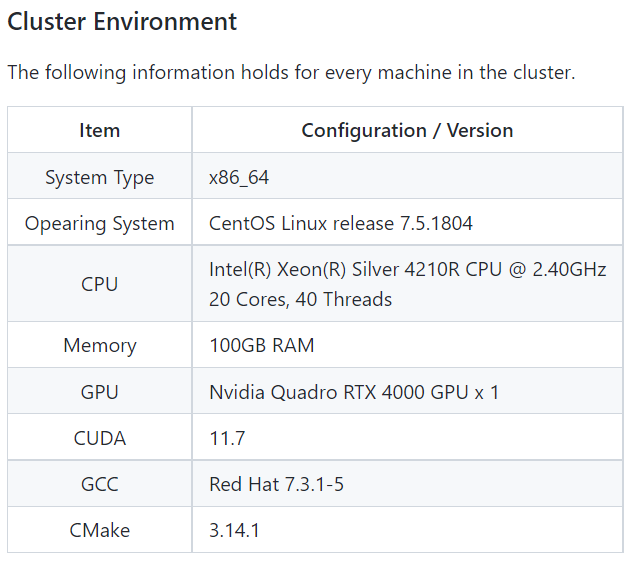

* Slurm Partition and Job

Partitions group nodes into logical sets, and jobs are allocations of resources assigned to a user for a specified amount of time. Partitions can be considered as job queues, each of which has an assortment of constraints such as job size limit, job time limit, users permitted to use it, etc. Priority-ordered jobs are allocated nodes within a partition until the resources (nodes, processors, memory, etc.) within that partition are exhausted. Once a job is assigned a set of nodes, the user is able to initiate parallel work within the allocation. There are two partitions in our cluster: Debug and Project.

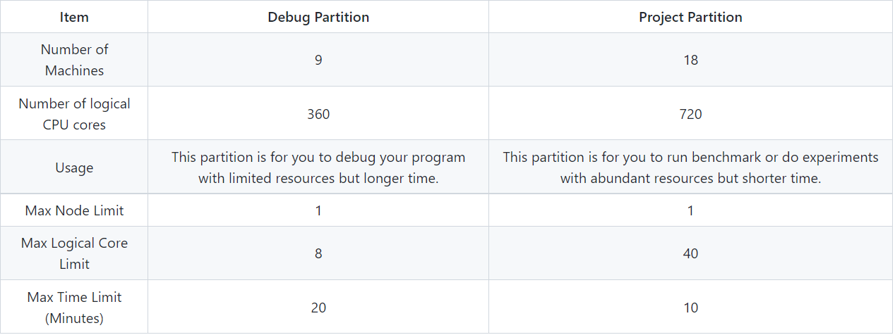

## 3. Execution Steps

In the source or bonus directory, use "sbatch ./slurm.sh", then the program runs and you just need to wait for the results.

The slurm.sh is like:

```sh
#!/bin/bash

##Resource Request

#SBATCH --job-name CSC3150_Assignment3
#SBATCH --gres=gpu:1
#SBATCH --output result.out   
#SBATCH --partition=Debug     	## the partitions to run in (comma seperated)
#SBATCH --ntasks=1  ## number of tasks (analyses) to run
#SBATCH --gpus-per-task=1 # number of gpus per task
#SBATCH --mem-per-gpu=100M # Memory allocated for the job
#SBATCH --time=0-00:02:00  ## time for analysis (day-hour:min:sec)

##Compile the cuda script using the nvcc compiler
nvcc --relocatable-device-code=true main.cu user_program.cu file_system.cu -o test

## Run the executable file
srun ./test
```

## 4. Output
### Source task
* test 1

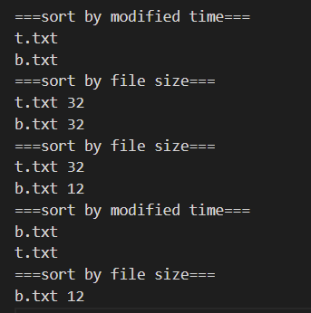

* test 2

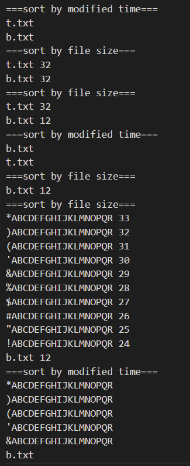

* test 3
Since it is too large, just show some segments.

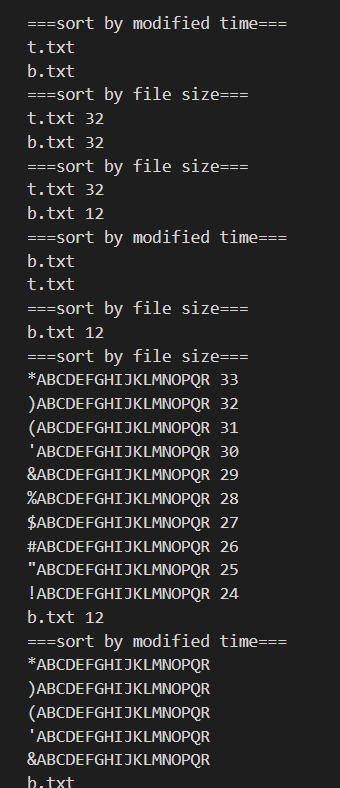

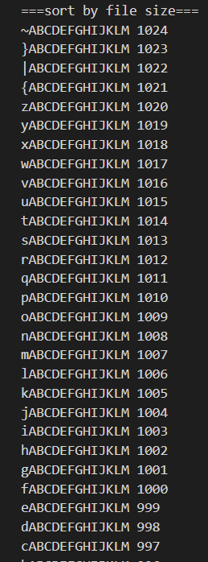

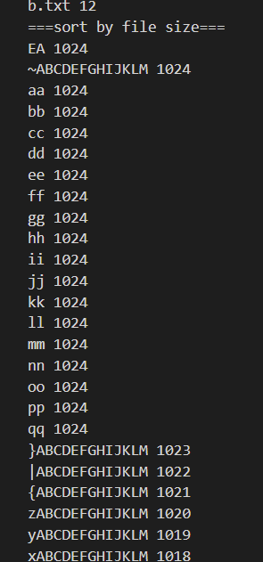

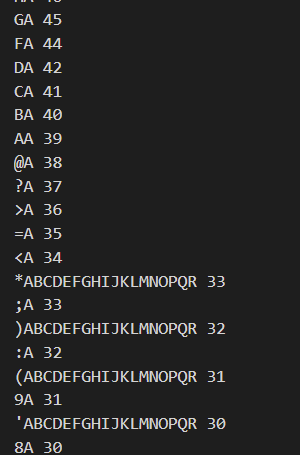

* test 4
Since it is too large, just show some segments.

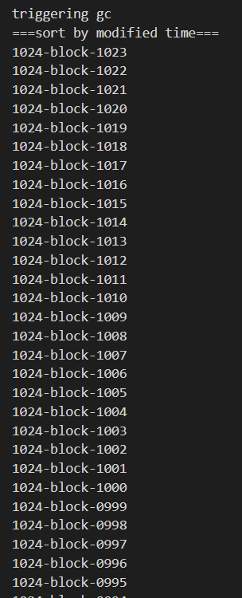

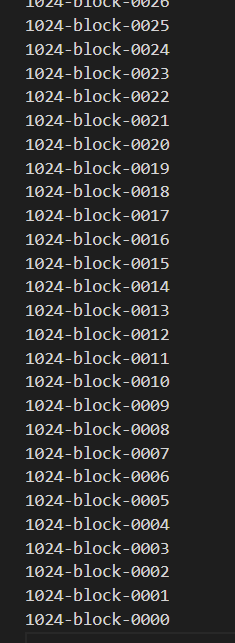


### Bonus task

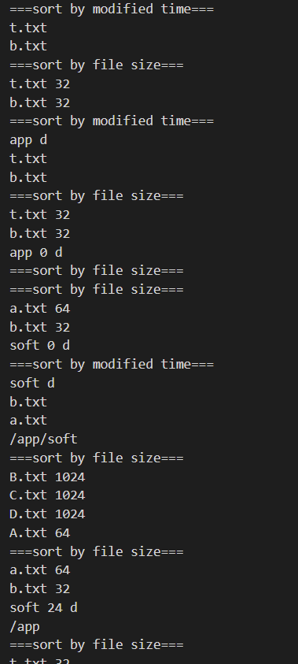

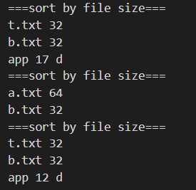


## 5. My feeling

* Understand the file system

Through this assignment, I learned about the structure and mechanism of the file system we use every day. It's hard for me to express how I feel when I find out that our filesystem can be implemented with some basic C++ code. Thanks to this assignment, I became more familiar with contiguous allocation and the use of bitmaps, and found my own way to achieve file content compression. I realize that if the external fragmentation is not resolved in time, it will be very serious.

* Basic knowledge about computer resources and CUDA programming

In this assignment, we also need to learn the basic knowledge about computer resources and CUDA programming. Through homework3 and this home work, I become more familiar with these fields. And this assignment gave me a chance to learn more about it later when I need it.

That's all of this report.